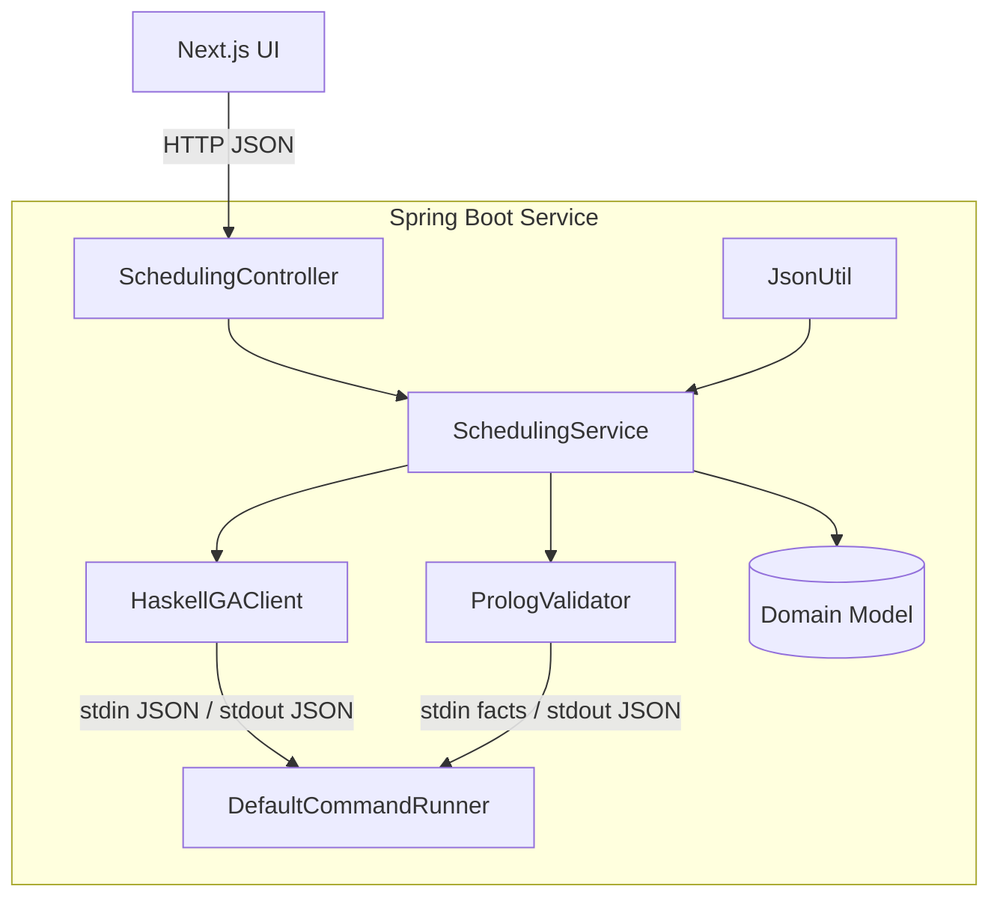
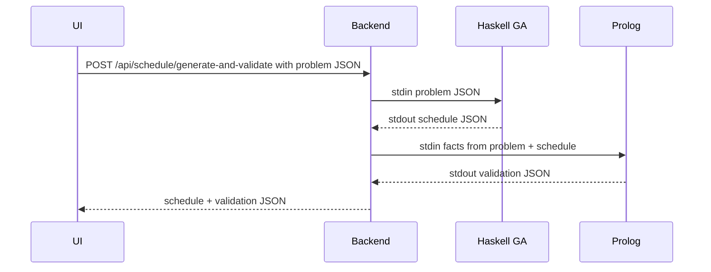

# Class Scheduling Solution
A multi‑paradigm course scheduling service using Spring Boot (Java), Haskell (genetic algorithm), SWI‑Prolog (validation), and Next.js (UI) that accepts a SchedulingProblem and provides endpoints to generate and validate schedules.

## Group Information

- Group Number: 5
- Group Members:
  - Degefaw, Eyouale
  - Wasswa, Richard
  - Ali, Husam
  - Velenczei, Adam

---


This project demonstrates a simple course scheduling service that integrates four paradigms:
- A Spring Boot REST API (Java)
- A Genetic Algorithm for schedule generation (Haskell)
- A Prolog validator for hard-constraint checking (SWI-Prolog)
- A Next.js UI for user interaction

The service accepts a SchedulingProblem (courses, lectures, rooms, time slots), generates a candidate schedule using a Haskell-based GA, and validates it with a Prolog program. It exposes endpoints to generate, validate, or do both in one request.


## Contributions

\- **Degefaw, Eyouale**: Implemented the Haskell genetic algorithm prototype, handled JSON parsing and printing, prepared sample data, contributed to the Next.js UI, and assisted with Prolog validator logic.

\- **Wasswa, Richard**: Developed the Java Spring Boot REST API, implemented Prolog constraints and validator rules, designed the JSON output structure, built fact conversion logic, orchestration service, command runner, integrated GA/Prolog, wrote backend tests, and contributed to Haskell GA integration.

\- **Ali, Husam**: Authored the project report, contributed to Dockerization, CI/CD configuration, documentation, and supported Haskell GA and Prolog validator testing.

\- **Velenczei, Adam**: Assisted with general project tasks, contributed to Haskell GA module testing and Prolog validator improvements.

# Introduction
- This project implements a class scheduling system using a mixed-paradigm architecture, integrating imperative, functional, and declarative programming alongside a modern web interface. The goal is to automatically generate and validate class schedules that satisfy predefined constraints while providing an intuitive interface for interaction.
- The Haskell component employs a simplified genetic algorithm to produce candidate schedules. Each schedule is represented as a chromosome — a list of lecture assignments mapping lectures to specific rooms and timeslots. The fitness function rewards capacity-satisfied assignments and penalises conflicts involving room or time overlaps. Genetic operators include elitist truncation selection, uniform per-gene crossover, and single-gene mutation. The current scope runs a single generation, with planned extensions for multi-generation loops, richer fitness metrics, tournament selection, and reproducible seeding. 
- The Prolog validator (`validator.pl`) enforces exactly three explicit scheduling rules:
  - Capacity not exceeded each assigned room must accommodate the enrolled students. 
  - No two different lectures in the same room and time — preventing double bookings. 
  - No overlapping lectures of the same course in the same time — ensuring no student is required to attend two lectures at once for the same course.
- By combining Haskell for smart searching, Prolog for rule checking, Java for integration, and Next.js for the user interface, the project shows that using different styles together makes scheduling simpler and more reliable.

## Project Idea Description
- This project is the simplest version of the class scheduling problem. The goal is to show that even a small example can be solved by combining different programming paradigms in one system.
- Making a timetable for courses in a university is not an easy job. There are many `courses`, `lectures` and `rooms`, but only a limited number of time slots. If done by hand, this work takes a lot of time and can lead to mistakes, such as two lectures at the same time in the same room or a teacher being scheduled for two classes at once. This type of scheduling problem is an `NP-hard problem`, which means it is very hard to find the perfect solution quickly when the problem is big. Because of this, we use methods that can find good (but not always perfect) solutions in a reasonable time. In this project, we built a small scheduling service that can make and check timetables automatically. To create the schedules, we use a simple genetic algorithm (GA). This algorithm works like natural selection: it creates different schedules, checks which ones are better, and improves them step by step. In our case, the GA assigns lectures to rooms and predefined time slots to reduce conflicts. The system takes in a scheduling problem (list of courses, lectures, rooms, and time slots) and produces a timetable that meets the given rules. It can also check (validate) an existing timetable to make sure it follows all rules. If the timetable is not valid, the system will revalidate it and give a detailed report showing exactly which rules are being violated. 
- The important part of this project is that it is built using multiple programming paradigms:
### Imperative
- Java (Spring Boot): backend REST API and coordination
- Next.js: web user interface
- Shell scripts: running and automating the whole stack
### Declarative
- Haskell: genetic algorithm (functional programming)
- Prolog: checking hard constraints (logic programming)
- By giving each paradigm the part it is best at — Java and Next.js for orchestration and UI, Haskell for complex schedule generation, and Prolog for precise rule checking — the project proves that even a small example of a class scheduling problem can be solved effectively using a multi-paradigm approach.

## Run everything with Docker Compose

Prerequisites:
\- Docker and Docker Compose plugin installed

Commands:
\- Build and start all services:
\- `docker compose up --build`
\- Access the UI: http://localhost:3000
\- Backend API: http://localhost:8080 (e.g., POST http://localhost:8080/api/schedule/generate)

What the command does:
- Builds both images (backend and UI)
- Starts both containers on a shared network
- Exposes ports: backend at http://localhost:8080, UI at http://localhost:3000

Stop the project:
- Press Ctrl+C in the terminal running the stack
- Then optionally clean up containers/networks/images: `docker compose down`

Notes:
- You can also skip rebuilding on subsequent runs: `docker compose up` (without `--build`) if nothing changed.
- If ports 8080 or 3000 are in use, stop the conflicting process or change the ports in docker-compose.yml.

##  Project Documentation and Structure
- This project implements a course scheduling service that bridges three paradigms:
Java (Spring Boot) REST API for orchestration
Haskell Genetic Algorithm (GA) for candidate schedule generation
SWI-Prolog for hard-constraint validation
Next.js UI for interacting with the backend
### Repository Structure
* Backend (Spring Boot, Java):
  - Source: `src/main/java/com/multiparadigm/scheduler`
  - Tests: `src/test/java/com/multiparadigm/scheduler`
* Haskell GA: `haskell/`
* Prolog validator: `prolog/ `
* UI (Next.js/TypeScript): `ui/`
* Containerization/Tooling: `Dockerfile`, `ui/Dockerfile`, `docker-compose.yml`,

#### Project Structure
```NONE 
├── Dockerfile
├── README.md
├── docker-compose.yml
├── haskell
│   ├── GeneticSchedule.hs
│   ├── GeneticScheduleTest.hs
│   ├── ga-exec
│   └── genetic_schedule_e2e_test_data.json
├── prolog
│   └── validator.pl
├── run.sh
├── src
│   ├── main
│   │   ├── java
│   │   └── resources
│   └── test
│       └── java
└── ui
```
### 3.1.1 Answer to the question: "Why did you select the programming languages you used for your project?"
#### Java :-
- Strong static typing and object-oriented structure for reliable, maintainable code.
- Simple to split into parts like configuration, orchestration, process runners, and adapters.
- Spring Boot enables quick creation of a REST API for JSON-based communication with Haskell and Prolog.
- Built-in support for spawning external processes, managing timeouts, and parsing JSON formats.
- Good speed and supports running tasks in parallel.
- All team members are already familiar with Java.

#### Haskell:-
- Functional style with strong typing helps avoid bugs and keep rules clear.
- Lazy evaluation skips work that is not needed.
- Short and clear code for crossover, mutation, and selection in the genetic algorithm
- Isolated JSON interface (problem in, schedule out) for easy integration.
- Fast compiled code, with the option to make only the slow parts faster when needed.
- Easy for the team to follow, with one Haskell expert helping others.
#### Prolog
- Easy to write rules for scheduling (like no double-bookings or checking room sizes).
- Backtracking quickly finds problems or confirms the schedule is valid.
- Simple to add or change rules 
#### Next.js
- Well-known framework that connects easily to REST APIs.
- The team already has experience using it.
- Gives a ready-to-use UI system so we can focus more on backend work.
- Reusable components save time when building the app.
- Built-in routing works without extra setup.

### 3.1.2 Answer to the question: "What was the most challenging parts of implementing this project? Please explain."
- The hardest part was building the Genetic Algorithm  in Haskell and making it work well with our Java backend and the Prolog validator. GAs are a common search method, but we had to change the normal design so it would work for our scheduling problem. We needed to represent courses, rooms, and time slots in a way that was fast to check and could be sent and received as JSON between programs.
- Haskell was not easy to learn, especially when writing GA functions like selection, crossover, and mutation in a clear and efficient way. We also had to make sure the GA would always finish quickly because the API had strict time limits. To keep things predictable, we only ran one generation: create the first set of schedules, score them, apply GA changes once, then choose the best result.
- Another problem was keeping the same data format in all three languages (Java, Haskell, Prolog). Each language needed its own copy of the data structures and JSON code, so any change had to be made three times. This made maintenance harder and increased the risk of mistakes.
- We also needed scripts to run the Haskell and Prolog programs from Java. The scripts had to compile or load the code, send JSON through standard input, read the output, and handle errors or timeouts.
- Testing was also tricky writing tests directly for Prolog was hard because its rules are declarative and the output can be complex. To solve this, we wrote Java tests that called Prolog and compared its results with what we expected. This way, we could still use Java’s test tools.
- Even if the GA gave us a good looking schedule, we always checked it in Prolog to make sure all hard rules were followed.


In short, the hardest parts were designing the GA, making three languages talk to each other, keeping data formats in sync, managing runtime scripts, and testing Prolog. We chose a simpler GA with strong validation so the system would be reliable, even if it wasn’t always perfectly optimized.

### 3.1.2 Answer to the question: " Does your implementation run and behave as expected? If not, what was the issue?"
- Yes, the implementation runs and behaves as expected. The system can generate schedules based on a given problem and validate them against hard constraints. The integration between the Java backend, Haskell GA, and Prolog validator works correctly, allowing for seamless communication and data exchange.
- Run the docker compose and access the UI at http://localhost:3000. You can generate schedules, validate them, and see the results in the browser.
## Architecture Overview

- Java (Spring Boot)
  - Acts as the central orchestrator for schedule generation and validation. 
  - Exposes a REST API consumed by the Next.js UI. 
  - Delegates computationally specialised tasks to external processes (Haskell GA generator, Prolog validator). 
  - Normalises data contracts JSON and enforces domain invariants before and after external calls.



- Core Packages / Classes
  - Controller (`web/SchedulingController`): Exposes REST endpoints; converts requests (DTOs) to domain objects and delegates all work to the service; returns responses and HTTP status codes.  
  - Service (`service/SchedulingService`): Orchestrates the end‑to‑end workflows by coordinating GA and validator clients and assembling results.  
  - GA Client (`ga/HaskellGAClient`): Invokes the Haskell GA executable with a SchedulingProblem JSON and parses the returned Schedule JSON into domain objects.  
  - Validator Client (`validation/PrologValidator`): Translates domain data to Prolog facts, runs the Prolog validator script, and parses the resulting ValidationResult JSON.  
  - Command Execution (`exec/DefaultCommandRunner, CommandRunner, CommandResult`): Generic process runner handling spawning, stdin/stdout/stderr, timeouts, exit codes, and returning a structured result.  
  - Domain Model (`model/*`): Canonical business entities (Course, Lecture, Room, TimeSlot, Assignment, Schedule, SchedulingProblem, ValidationResult, Violation) independent of transport or persistence concerns.  
  - DTOs (`web/dto/*`): External API contract objects used at the controller boundary to isolate clients from internal domain changes.  
  - JSON Utility (`util/JsonUtil`): Centralised JSON (de) serialisation (single ObjectMapper config), ensuring consistent formats and error handling across components.  
  - Config (`ProjectConfig`): Spring configuration wiring beans (command runner, clients), injecting executable paths/timeouts, and setting CORS.


- Haskell (Genetic Algorithm)
  - `GeneticSchedule.hs`: Main GA module; reads SchedulingProblem JSON from stdin, builds initial population, applies fitness, selection, crossover, mutation for a few generations (or a single iteration), and writes the best Schedule as JSON to stdout.
  - `ga-exec`: Built/packaged executable (or wrapper script) that invokes the compiled Haskell program with the correct runtime environment; used by Java so it can treat GA generation as a single external command.
  - `GeneticScheduleTest.hs`: Test module containing a copy of core GA logic plus test cases (e.g., fitness, mutation, JSON round‑trip); used only for testing.
  - `genetic_schedule_e2e_test_data.json`: Example problem JSON fixture for E2E testing.
- Prolog (Validator)
  - `Prolog/validator.pl`: Reads Prolog facts on stdin and prints JSON validation results to stdout.
- Next.js - `UI` 
   - Provides schedule building, visualisation, and interaction with the REST API.

## Data flow:

## Endpoints

Base path: `/api/schedule` (consumes/produces `application/json`)

- POST `/generate`
  - Body: SchedulingProblem JSON
  - Response: Schedule JSON
- POST `/validate`
  - Body: `{ "problem": SchedulingProblem, "schedule": Schedule }`
  - Response: ValidationResult JSON (`{valid: boolean, violations: [...]}`)
- POST `/generate-and-validate`
  - Body: SchedulingProblem JSON
  - Response: `{ "schedule": Schedule, "validation": ValidationResult }`

See `src/main/java/com/paradigms/project/web/SchedulingController.java` for signatures and DTOs.


## Running Tests (Java with Maven and Haskell)

### Java tests (Maven):
- Run all tests:
```shell
    ./mvnw test
```

### Haskell tests:
- Run Unit tests for the GA fitness function:
```shell
    stack script --resolver lts-21.25 -- haskell/GeneticScheduleTest.hs
```
- End-to-end sample run of the GA with the provided fixture (writes Schedule JSON to stdout):
```shell
    chmod +x haskell/ga-exec   # first time only
```
```shell
  cat haskell/genetic_schedule_e2e_test_data.json | haskell/ga-exec # update the genetic_schedule_e2e_test_data.json file with your own data
```
