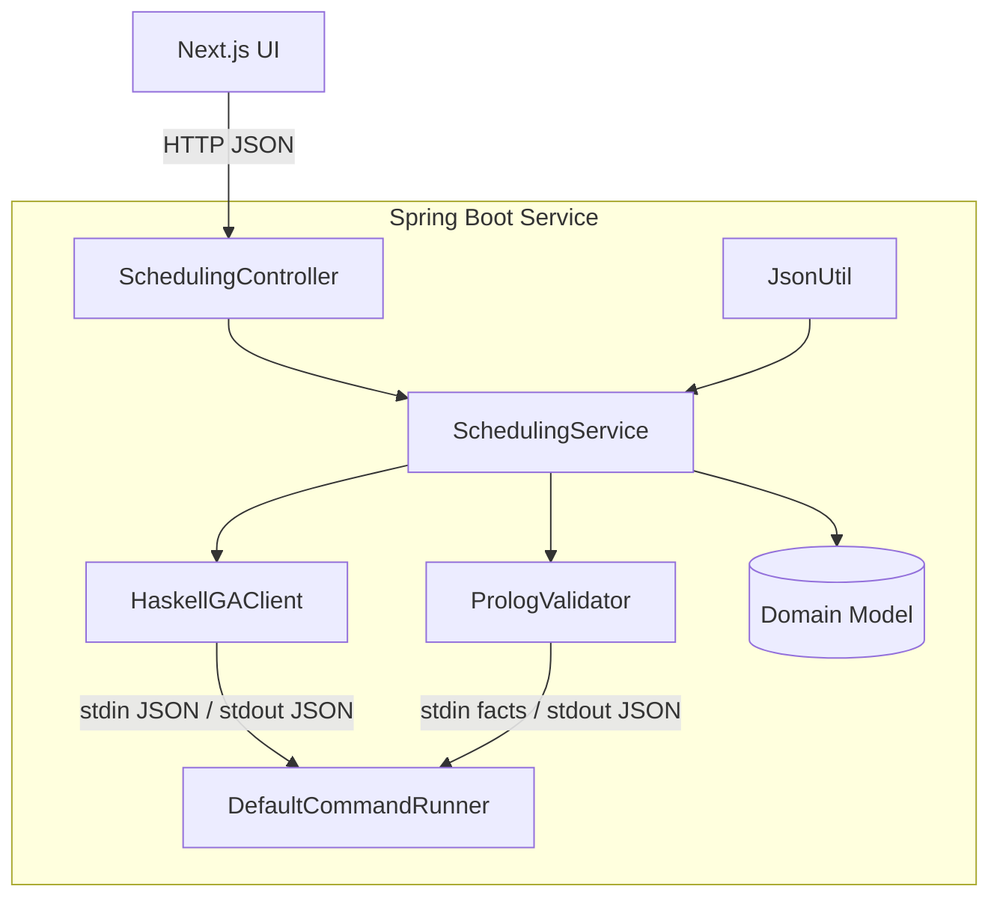
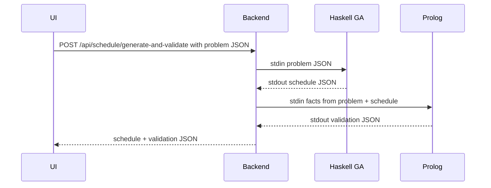

# Class Scheduling Solution
A multi-paradigm course scheduling service using Spring Boot, Haskell, and Prolog.

## Group Information

- \*\*Group Number\*\*: 5
- \*\*Group Members\*\*:
    - Degefaw, Eyouale
    - Wasswa, Richard
    - Ali, Husam
    - Velenczei, Adam
---

This project demonstrates a simple course scheduling service that integrates four paradigms:
- A Spring Boot REST API (Java)
- A Genetic Algorithm for schedule generation (Haskell)
- A Prolog validator for hard-constraint checking (SWI-Prolog)
- A Next.js UI for user interaction

The service accepts a SchedulingProblem (courses, lectures, rooms, time slots), generates a candidate schedule using a Haskell-based GA, and validates it with a Prolog program. It exposes endpoints to generate, validate, or do both in one request.

## Contributions

\- **Degefaw, Eyouale**: Implemented the Haskell genetic algorithm prototype, handled JSON parsing and printing, prepared sample data, contributed to the Next.js UI, and assisted with Prolog validator logic.

\- **Wasswa, Richard**: Developed the Java Spring Boot REST API, implemented Prolog constraints and validator rules, designed the JSON output structure, built fact conversion logic, orchestration service, command runner, integrated GA/Prolog, wrote backend tests, and contributed to Haskell GA integration.

\- **Ali, Husam**: Authored the project report, contributed to Dockerization, CI/CD configuration, documentation, and supported Haskell GA and Prolog validator testing.

\- **Velenczei, Adam**: Assisted with general project tasks, contributed to Haskell GA module testing and Prolog validator improvements.

## Quick Start

- Start the whole stack (backend + UI) with Docker Compose:
  - docker compose up --build
- Backend API: http://localhost:8080 (e.g., POST /api/schedule/generate)
- UI: http://localhost:3000

## Start the project (run everything)

Prerequisites:
- Docker Desktop or Docker Engine with the Docker Compose plugin

Run everything (backend + UI):
- macOS/Linux:
  - Make the script executable once: `chmod +x ./run.sh`
  - Start: `./run.sh`
- Windows (PowerShell):
  - `docker compose up --build`

What the command does:
- Builds both images (backend and UI)
- Starts both containers on a shared network
- Exposes ports: backend at http://localhost:8080, UI at http://localhost:3000

Stop the project:
- Press Ctrl+C in the terminal running the stack
- Then optionally clean up containers/networks/images: `docker compose down`

Notes:
- You can also skip rebuilding on subsequent runs: `docker compose up` (without `--build`) if nothing changed.
- If ports 8080 or 3000 are in use, stop the conflicting process or change the ports in docker-compose.yml.

## Architecture Overview

- Java (Spring Boot)
  - Acts as the central orchestrator for schedule generation and validation. 
  - Exposes a REST API consumed by the Next.js UI. 
  - Delegates computationally specialised tasks to external processes (Haskell GA generator, Prolog validator). 
  - Normalises data contracts JSON and enforces domain invariants before and after external calls.

- Core Packages / Classes
  - Controller (`web/SchedulingController`): Exposes REST endpoints; converts requests (DTOs) to domain objects and delegates all work to the service; returns responses and HTTP status codes.  
  - Service (`service/SchedulingService`): Orchestrates the end‑to‑end workflows by coordinating GA and validator clients and assembling results.  
  - GA Client (`ga/HaskellGAClient`): Invokes the Haskell GA executable with a SchedulingProblem JSON and parses the returned Schedule JSON into domain objects.  
  - Validator Client (`validation/PrologValidator`): Translates domain data to Prolog facts, runs the Prolog validator script, and parses the resulting ValidationResult JSON.  
  - Command Execution (`exec/DefaultCommandRunner, CommandRunner, CommandResult`): Generic process runner handling spawning, stdin/stdout/stderr, timeouts, exit codes, and returning a structured result.  
  - Domain Model (`model/*`): Canonical business entities (Course, Lecture, Room, TimeSlot, Assignment, Schedule, SchedulingProblem, ValidationResult, Violation) independent of transport or persistence concerns.  
  - DTOs (`web/dto/*`): External API contract objects used at the controller boundary to isolate clients from internal domain changes.  
  - JSON Utility (`util/JsonUtil`): Centralised JSON (de) serialisation (single ObjectMapper config), ensuring consistent formats and error handling across components.  
  - Config (`ProjectConfig`): Spring configuration wiring beans (command runner, clients), injecting executable paths/timeouts, and setting CORS.

- Haskell (Genetic Algorithm)
  - `GeneticSchedule.hs`: Main GA module; reads SchedulingProblem JSON from stdin, builds initial population, applies fitness, selection, crossover, mutation for a few generations (or a single iteration), and writes the best Schedule as JSON to stdout.
  - `ga-exec`: Built/packaged executable (or wrapper script) that invokes the compiled Haskell program with the correct runtime environment; used by Java so it can treat GA generation as a single external command.
  - `GeneticScheduleTest.hs`: Test module containing a copy of core GA logic plus test cases (e.g., fitness, mutation, JSON round‑trip); used only for testing.
  - `genetic_schedule_e2e_test_data.json`: Example problem JSON fixture for E2E testing.
- Prolog (Validator)
  - `Prolog/validator.pl`: Reads Prolog facts on stdin and prints JSON validation results to stdout.
- Next.js - `UI` 
   - Provides schedule building, visualisation, and interaction with the REST API.

## Data flow:

## Endpoints

Base path: `/api/schedule` (consumes/produces `application/json`)

- POST `/generate`
  - Body: SchedulingProblem JSON
  - Response: Schedule JSON
- POST `/validate`
  - Body: `{ "problem": SchedulingProblem, "schedule": Schedule }`
  - Response: ValidationResult JSON (`{valid: boolean, violations: [...]}`)
- POST `/generate-and-validate`
  - Body: SchedulingProblem JSON
  - Response: `{ "schedule": Schedule, "validation": ValidationResult }`

See `src/main/java/com/paradigms/project/web/SchedulingController.java` for signatures and DTOs.

## Run everything with Docker Compose

Prerequisites:
\- Docker and Docker Compose plugin installed

Commands:
\- Build and start all services:
  \- `docker compose up --build`
\- Access the UI: http://localhost:3000
\- Backend API: http://localhost:8080 (e.g., POST http://localhost:8080/api/schedule/generate)

